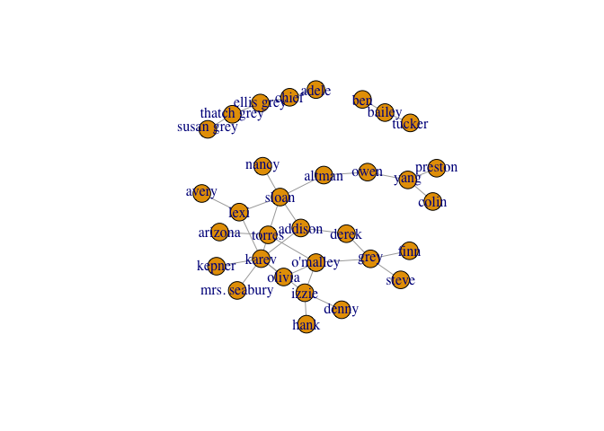
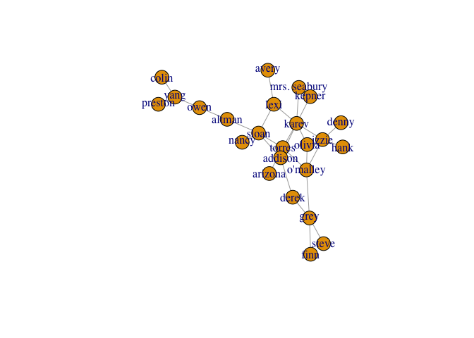
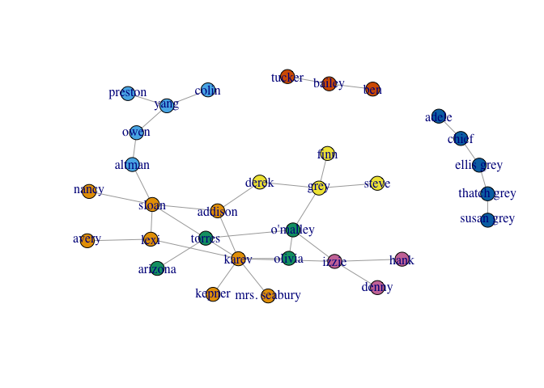
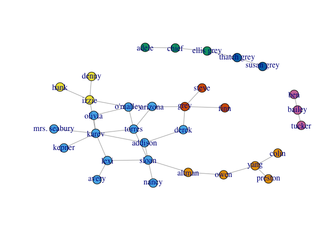
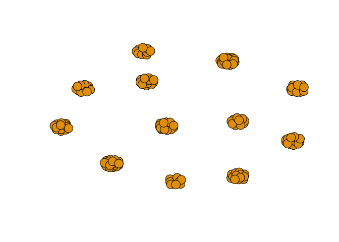
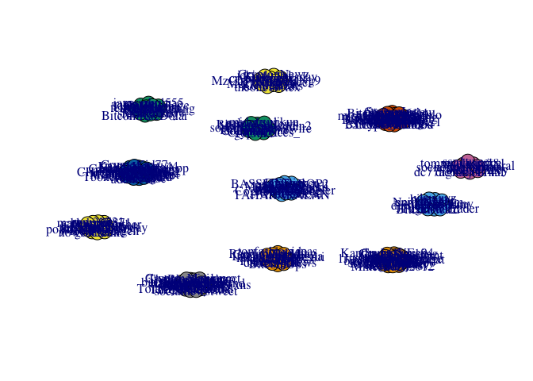
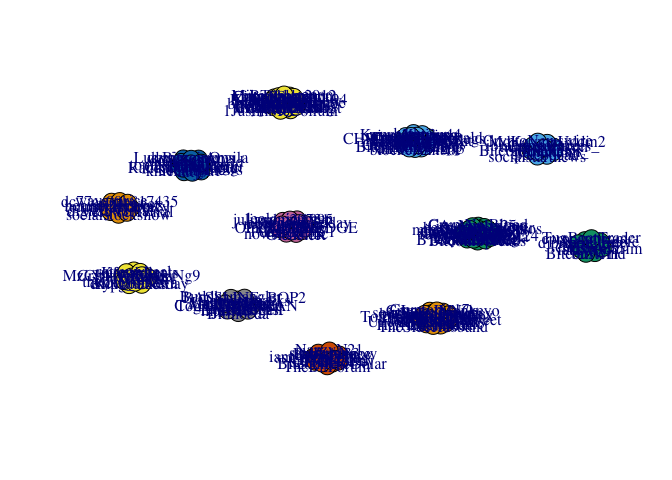

Hw3
================
Naor Dalal & Koren Levenbrown
12/26/2017

1.A
---

``` r
library(igraph)
```

    ## 
    ## Attaching package: 'igraph'

    ## The following objects are masked from 'package:stats':
    ## 
    ##     decompose, spectrum

    ## The following object is masked from 'package:base':
    ## 
    ##     union

``` r
ga.data <- read.csv('part1/ga_edgelist.csv', header = T)
g <- graph.data.frame(ga.data,directed = F)
plot(g)
```



``` r
gDerived <- delete.vertices(g , c('adele' , 'chief' , 'susan grey' , 'thatch grey' , 'ellis grey' , 'tucker' , 'bailey' , 'ben'))
plot(gDerived)
```



### i. By Betweenness

``` r
between <- betweenness(gDerived)
between[which.max(between)]
```

    ##    sloan 
    ## 115.3667

### ii. By closeness

``` r
close <- closeness(gDerived)
close[which.max(close)]
```

    ##     torres 
    ## 0.01754386

### iii. By Eigenvector

``` r
eig <- eigen_centrality(gDerived)
eig$vector[which.max(eig$vector)]
```

    ## karev 
    ##     1

1.B
---

### Girvan-Newman community detection

``` r
gc <- edge.betweenness.community(g)
gc
```

    ## IGRAPH clustering edge betweenness, groups: 7, mod: 0.58
    ## + groups:
    ##   $`1`
    ##   [1] "lexi"         "sloan"        "karev"        "kepner"      
    ##   [5] "addison"      "nancy"        "mrs. seabury" "avery"       
    ##   
    ##   $`2`
    ##   [1] "owen"    "yang"    "altman"  "colin"   "preston"
    ##   
    ##   $`3`
    ##   [1] "torres"   "o'malley" "arizona"  "olivia"  
    ##   
    ##   + ... omitted several groups/vertices

``` r
memb <- membership(gc)
memb
```

    ##         lexi         owen        sloan       torres        derek 
    ##            1            2            1            3            4 
    ##        karev     o'malley         yang         grey        chief 
    ##            1            3            2            4            5 
    ##   ellis grey   susan grey       bailey        izzie       altman 
    ##            5            5            6            7            2 
    ##      arizona        colin      preston       kepner      addison 
    ##            3            2            2            1            1 
    ##        nancy       olivia mrs. seabury        adele  thatch grey 
    ##            1            3            1            5            5 
    ##       tucker         hank        denny         finn        steve 
    ##            6            7            7            4            4 
    ##          ben        avery 
    ##            6            1

Plot the graph with unique color for each community accordingly

``` r
plot(g, vertex.size=7, #vertex.label=NA,
     vertex.color=memb, asp=FALSE)
```



There is 7 communities

``` r
length(unique(memb))
```

    ## [1] 7

The size of each community

``` r
t <- as.data.frame(table(memb))
colnames(t) <- c('ID' , 'Size')
t
```

    ##   ID Size
    ## 1  1    8
    ## 2  2    5
    ## 3  3    4
    ## 4  4    4
    ## 5  5    5
    ## 6  6    3
    ## 7  7    3

The modularity

``` r
gc$modularity
```

    ##  [1] -0.04584775 -0.01773356  0.01081315  0.03849481  0.06617647
    ##  [6]  0.09472318  0.12326990  0.14965398  0.17560554  0.20285467
    ## [11]  0.23096886  0.25865052  0.28633218  0.31358131  0.34083045
    ## [16]  0.36894464  0.39576125  0.41479239  0.44247405  0.46712803
    ## [21]  0.49134948  0.50778547  0.52681661  0.54974048  0.57050173
    ## [26]  0.57742215  0.56098616  0.53416955  0.45804498  0.30449827

### walktrap community

``` r
gc1 <- walktrap.community(g)
gc1
```

    ## IGRAPH clustering walktrap, groups: 7, mod: 0.51
    ## + groups:
    ##   $`1`
    ##   [1] "owen"    "yang"    "altman"  "colin"   "preston"
    ##   
    ##   $`2`
    ##    [1] "lexi"         "sloan"        "torres"       "derek"       
    ##    [5] "karev"        "o'malley"     "arizona"      "kepner"      
    ##    [9] "addison"      "nancy"        "olivia"       "mrs. seabury"
    ##   [13] "avery"       
    ##   
    ##   $`3`
    ##   + ... omitted several groups/vertices

``` r
memb1 <- membership(gc1)
memb1
```

    ##         lexi         owen        sloan       torres        derek 
    ##            2            1            2            2            2 
    ##        karev     o'malley         yang         grey        chief 
    ##            2            2            1            6            3 
    ##   ellis grey   susan grey       bailey        izzie       altman 
    ##            3            5            7            4            1 
    ##      arizona        colin      preston       kepner      addison 
    ##            2            1            1            2            2 
    ##        nancy       olivia mrs. seabury        adele  thatch grey 
    ##            2            2            2            3            5 
    ##       tucker         hank        denny         finn        steve 
    ##            7            4            4            6            6 
    ##          ben        avery 
    ##            7            2

Plot the graph with unique color for each community accordingly

``` r
plot(g, vertex.size=7, #vertex.label=NA,
     vertex.color=memb1, asp=FALSE)
```



There is 7 communities

``` r
length(unique(memb1))
```

    ## [1] 7

The size of each community

``` r
t1 <- as.data.frame(table(memb1))
colnames(t1) <- c('ID' , 'Size')
t1
```

    ##   ID Size
    ## 1  1    5
    ## 2  2   13
    ## 3  3    3
    ## 4  4    3
    ## 5  5    2
    ## 6  6    3
    ## 7  7    3

The modularity

``` r
gc1$modularity
```

    ##  [1]  0.00000000 -0.01730106  0.01081313  0.03676469  0.06487888
    ##  [6]  0.09256054  0.12024221  0.14749134  0.17387544  0.19982699
    ## [11]  0.22837371  0.25692043  0.28460205  0.31185120  0.33910033
    ## [16]  0.36678201  0.39489621  0.42171276  0.44939446  0.45544982
    ## [21]  0.48226649  0.47923881  0.49567476  0.48875433  0.49394464
    ## [26]  0.51470590  0.48269898  0.50562286  0.45804498  0.30449831
    ## [31]  0.00000000  0.00000000

2
-

``` r
library(igraph)
library(twitteR)
library(tm)
```

    ## Warning: package 'tm' was built under R version 3.4.3

    ## Loading required package: NLP

``` r
library(httr)
```

    ## 
    ## Attaching package: 'httr'

    ## The following object is masked from 'package:NLP':
    ## 
    ##     content

Set twitter keys

``` r
consumer_key <- "Y0NniYiJCKL7qqbrreh6p9P4F"
consumer_secret <- "yZlDnWZEB20LrrdVPXwTIY6skmuj9N3iljcO3cGvugrwSJlhYu"
access_token <- "945458627669786624-LsmOz4oCzo0lT6UHwSkPv6hT0inP47x"
access_secret <- "2jwReQYUJHFTDAjQhs0y3Yt1v4MAO2zyAddddBXMVJF4N"
```

Set up the OAuth credentials for a twitteR session

``` r
sig <- setup_twitter_oauth(consumer_key, consumer_secret, access_token, access_secret)
```

    ## [1] "Using direct authentication"

    ## Warning in strptime(x, fmt, tz = "GMT"): unknown timezone 'zone/tz/2017c.
    ## 1.0/zoneinfo/Asia/Jerusalem'

2.A
---

### Search tweets on bitcoin on english since 01/12/2017

``` r
tweets <- searchTwitter("#bitcoin", n=200 , lang = "en" , since = "2017-12-01")
```

convert the tweets to dataFrame

``` r
tweetsDf <- twListToDF(tweets)
summary(tweetsDf)
```

    ##      text           favorited       favoriteCount    replyToSN        
    ##  Length:200         Mode :logical   Min.   :0.000   Length:200        
    ##  Class :character   FALSE:200       1st Qu.:0.000   Class :character  
    ##  Mode  :character                   Median :0.000   Mode  :character  
    ##                                     Mean   :0.085                     
    ##                                     3rd Qu.:0.000                     
    ##                                     Max.   :4.000                     
    ##     created                    truncated        replyToSID       
    ##  Min.   :2017-12-26 01:52:20   Mode :logical   Length:200        
    ##  1st Qu.:2017-12-26 01:55:00   FALSE:163       Class :character  
    ##  Median :2017-12-26 01:57:01   TRUE :37        Mode  :character  
    ##  Mean   :2017-12-26 01:57:10                                     
    ##  3rd Qu.:2017-12-26 01:59:48                                     
    ##  Max.   :2017-12-26 02:01:14                                     
    ##       id             replyToUID        statusSource      
    ##  Length:200         Length:200         Length:200        
    ##  Class :character   Class :character   Class :character  
    ##  Mode  :character   Mode  :character   Mode  :character  
    ##                                                          
    ##                                                          
    ##                                                          
    ##   screenName         retweetCount     isRetweet       retweeted      
    ##  Length:200         Min.   :   0.00   Mode :logical   Mode :logical  
    ##  Class :character   1st Qu.:   0.00   FALSE:107       FALSE:200      
    ##  Mode  :character   Median :   0.00   TRUE :93                       
    ##                     Mean   :  69.61                                  
    ##                     3rd Qu.:  30.25                                  
    ##                     Max.   :1957.00                                  
    ##  longitude      latitude      
    ##  Mode:logical   Mode:logical  
    ##  NA's:200       NA's:200      
    ##                               
    ##                               
    ##                               
    ## 

Get users that publish the tweets

``` r
users <- twListToDF(lookupUsers(tweetsDf$screenName))
```

2.B
---

Our vertexes are user's names and the edge between two users means that their account created on the same month

``` r
library(lubridate)
```

    ## 
    ## Attaching package: 'lubridate'

    ## The following object is masked from 'package:igraph':
    ## 
    ##     %--%

    ## The following object is masked from 'package:base':
    ## 
    ##     date

``` r
users1Edge <- c()
users2Edge <- c()

for(i in 1:nrow(users))
{
  for(j in 1:nrow(users))
  {
    user1 <- users[i,]
    user2 <- users[j,]
    user1Month <- month(as.POSIXlt(user1$created, format="%d/%m/%Y"))
    user2Month <- month(as.POSIXlt(user2$created, format="%d/%m/%Y"))
    
    if((user1$screenName != user2$screenName) && user1Month == user2Month)
    {
      users1Edge <- c(users1Edge , user1$screenName)
      users2Edge <- c(users2Edge , user2$screenName)
    }
  }
}
```

2.C
---

Create file from users1Edge and users2Edge and read the file to graph

``` r
res <- cbind(from = users1Edge , to = users2Edge)
write.csv(res , file = "part2/tweets.csv" , row.names = FALSE)
ga.data <- read.csv('part2/tweets.csv', header = T)
g <- graph.data.frame(ga.data,directed = F)
plot(g, vertex.size=7, vertex.label=NA, asp=FALSE)
```



2.D
---

### 1.A

### i. By Betweenness

``` r
between <- betweenness(g)
between[which.max(between)]
```

    ## topfashionideas 
    ##               0

### ii. By closeness

``` r
close <- closeness(g)
close[which.max(close)]
```

    ##   abidoank12 
    ## 3.555682e-05

### iii. By Eigenvector

``` r
eig <- eigen_centrality(g)
eig$vector[which.max(eig$vector)]
```

    ## Ragnarly 
    ##        1

### 1.B

### Girvan-Newman community detection

``` r
gc <- edge.betweenness.community(g)
gc
```

    ## IGRAPH clustering edge betweenness, groups: 12, mod: 0.89
    ## + groups:
    ##   $`1`
    ##    [1] "topfashionideas" "CryptoJauregui"  "Polite_Jerk"    
    ##    [4] "BitcoinOps"      "khichariya1"     "darren_yan"     
    ##    [7] "dodadopp"        "LudwigsenAngila" "sydni519"       
    ##   [10] "socialprnews"    "RandallGoulding" "hitjo"          
    ##   [13] "CryptoW0rld"    
    ##   
    ##   $`2`
    ##    [1] "EvaBlaisdell"   "eiyeorch"       "Torosernjacks"  "mvasey"        
    ##    [5] "CogitoErgoCode" "TAHARARALAN"    "BTCticker"      "coinstats"     
    ##   + ... omitted several groups/vertices

``` r
memb <- membership(gc)
memb
```

    ## topfashionideas    EvaBlaisdell  CryptoJauregui        eiyeorch 
    ##               1               2               1               2 
    ##   CryptoPrices_     cryptananda       Coinnnnn_        reubeng0 
    ##               3               4               3               5 
    ##       StreamIn_     Polite_Jerk   Torosernjacks     FeesBitcoin 
    ##               6               1               2               5 
    ##     Crypto_Newz  CryptoRidiculo      wavesprice       block_bit 
    ##               4               6               7               8 
    ##      abidoank12         vkeyxyz CityofInvestmnt      sabbir1133 
    ##               9              10               9              11 
    ##     whaleclubco HarrietteFarkas          mvasey     rottenwheel 
    ##               6               8               2               4 
    ## strange10change  CogitoErgoCode        BtcPulse TommyeKirkendal 
    ##               9               2               5               8 
    ##    coinradar_io     TAHARARALAN dc77ae00b817435       chrisleu2 
    ##               9               2               7              10 
    ##      BitcoinOps     Cryptonic17  BitcoinSpreads       BTCticker 
    ##               1               8               6               2 
    ##      btcreports          betbtc     crypto_rush    TheeJimmyCox 
    ##               8               5               8               8 
    ##     CryptoSeven BitcoinKacDolar       coinstats UnconfirmedTxns 
    ##               9              11               2               8 
    ##    BTCdominance  digitaljournal        Anon_Emy  TboneMacdonald 
    ##               6               7              10               5 
    ##         Chey999        bitstein    antoni161273        Bitmoeda 
    ##               9              10               5               2 
    ##    steveouttrim        Ragnarly     khichariya1  CHP_the_RIPPER 
    ##              10               9               1               5 
    ##       latigo661        GlencieR  Crypto_Monkeyo Nationalacrobat 
    ##               6              12               8               9 
    ##      blkchdemcy      btcbeehive     Bitcoin_UAE   BitcoinUkNews 
    ##               7               5               8               3 
    ##     miamipeoria  CryptoStacking  tommyalvarez81     jmvillegast 
    ##               5               9               7               2 
    ## CarlaCoinsNLegs         tigzorr         adam3us  bitcoin_miner_ 
    ##               5               4               5               9 
    ##  ibrahimsilence      ESellhamer MIParentalRlght    henrynburton 
    ##               3               6               5               7 
    ##        mktm9871      darren_yan  bitcoinnewsweb  juliarahma1995 
    ##              12               1               8              12 
    ##   blockchainbot    maestrejoseg BitcoinInvest24    Soc_Currency 
    ##               5               5               6               8 
    ## socialstocksnow    iam_rahul555    PatPrivilege        dodadopp 
    ##               7              11              11               1 
    ##          s_H4k4 LudwigsenAngila    eprocentteam    bitcointonic 
    ##              11               1              10               8 
    ##       socmrktng  socialstartnow    nowsocialinc socialnewstweet 
    ##               6               9              12               8 
    ##     getitoutnow  socmediaimpact       Just_JUNO     FTS_Billing 
    ##              11               8               8              12 
    ##   Kandy_LOVE_94  politicalHEDGE jeffvillalobos3         RTrobby 
    ##               9              12               6               9 
    ##        steemero     BitcoinWrld    BrutallyDoke       paleodead 
    ##              11              10               9               3 
    ##        sydni519 bitcoinfirehose   CryptNotBlood    socialprnews 
    ##               1               9               6               1 
    ##    socialirnews RandallGoulding       ssn3media socialstartnews 
    ##               9               1               4               3 
    ##       ssn1tweet   ssn4marketing       GetOvarIt 1JustinMcCollum 
    ##               7              11               9               9 
    ##     hotload2000 MzCh11KiETHaNg9      KovshBeats       roni20731 
    ##               9               4               4              12 
    ##    Kayy_Kayy_44         ondhro1      UndersHead  TheSideHusband 
    ##               5               8               2               8 
    ##        goldseek        btcmrkts    realSatoshiN   egaconsulting 
    ##              12              12               5               6 
    ##   findingreview       davidar12         g0t3nk5      NeilOKeefe 
    ##               6              12               3              10 
    ##      37angelsny    King_Tuesday  hexagram_power         xbtnews 
    ##              11               4               6               4 
    ##   leola_joergen      KalEl_1987     Crystal0182      cryptomiao 
    ##              12               9               6               6 
    ##   MdKayumUddin2   BASSLINE_BOP2  CryptoNewswire    midousujikun 
    ##               3               2               3               3 
    ##      jekiedugn1      btc_update        matslats   TheBlockchain 
    ##               4               9               2               8 
    ##     OmegaLuther   VeryVeriViral eStream_Studios  eBargainsToday 
    ##              12               7               6              12 
    ##     TheBitForum        NazzyN21   MikeAlden2012        DMVLife1 
    ##              11              11               9              11 
    ##   mempool_stats   Buddhamangler           hitjo    djprincealby 
    ##               5               2               1              10 
    ##         fakent_   TugBoatTrader     CryptoW0rld      CA_Minho25 
    ##              10              10               1               6 
    ##   shushmashri21      markuspdee      JacekSalaj     tell_taylor 
    ##               6              12               5              11 
    ##     Priya_upala      MattLeft99    theonevortex     CryptoKid77 
    ##               6               2               4               5 
    ##  BitcoinCashApp michael55038689      McclamNeva 
    ##               5               6               4

Plot the graph with unique color for each community accordingly

``` r
plot(g, vertex.size=7, #vertex.label=NA,
     vertex.color=memb, asp=FALSE)
```



There is 12 communities

``` r
length(unique(memb))
```

    ## [1] 12

The size of each community

``` r
t <- as.data.frame(table(memb))
colnames(t) <- c('ID' , 'Size')
t
```

    ##    ID Size
    ## 1   1   13
    ## 2   2   15
    ## 3   3   10
    ## 4   4   12
    ## 5   5   20
    ## 6   6   21
    ## 7   7    9
    ## 8   8   19
    ## 9   9   22
    ## 10 10   11
    ## 11 11   13
    ## 12 12   14

The modularity

``` r
gc$modularity
```

    ##   [1] -0.006045729 -0.005406431 -0.004701871 -0.004073179 -0.002794583
    ##   [6] -0.001537197  0.000348881  0.001059152  0.002479693  0.003177998
    ##  [11]  0.003862164  0.005780058  0.006478363  0.007874975  0.009969892
    ##  [16]  0.010661400  0.013176171  0.014559186  0.015927518  0.016545061
    ##  [21]  0.017954182  0.018669619  0.020722116  0.022152990  0.025296454
    ##  [26]  0.029068610  0.030303698  0.032378221  0.034491901  0.038892750
    ##  [31]  0.041710991  0.044504214  0.046635025  0.048781337  0.051547367
    ##  [36]  0.056576909  0.062235144  0.064792336  0.068249874  0.072398920
    ##  [41]  0.073048279  0.075784941  0.077083660  0.080280149  0.085120702
    ##  [46]  0.088643503  0.092870863  0.094723495  0.097193670  0.100281389
    ##  [51]  0.103772918  0.104492978  0.107354726  0.112286647  0.113683258
    ##  [56]  0.117388521  0.119483439  0.125770366  0.130093173  0.132886396
    ##  [61]  0.136463582  0.141403932  0.144245014  0.148434849  0.153992743
    ##  [66]  0.160908363  0.166440424  0.172615862  0.178839431  0.180787508
    ##  [71]  0.183384945  0.188273085  0.191519881  0.198434957  0.205227939
    ##  [76]  0.212772252  0.216668407  0.220219760  0.223711289  0.229297735
    ##  [81]  0.233487570  0.239772322  0.246755380  0.248195500  0.252741013
    ##  [86]  0.260914019  0.264749806  0.269224891  0.276831476  0.282026349
    ##  [91]  0.286914489  0.295212581  0.297372760  0.302487143  0.311288842
    ##  [96]  0.315581465  0.322991990  0.328745671  0.334382152  0.340775130
    ## [101]  0.344195959  0.347076198  0.355104267  0.362136544  0.367144604
    ## [106]  0.372988836  0.380660410  0.384260710  0.392906323  0.399399914
    ## [111]  0.408389513  0.417819905  0.426130777  0.431717223  0.440980380
    ## [116]  0.445242003  0.449346997  0.458297167  0.463269061  0.473149762
    ## [121]  0.482739230  0.488421394  0.492741753  0.502800837  0.509943787
    ## [126]  0.514732947  0.522414311  0.532912555  0.540704865  0.549146533
    ## [131]  0.559375299  0.568466327  0.573939652  0.584627429  0.594367816
    ## [136]  0.600652568  0.607045003  0.612085422  0.618242913  0.629358701
    ## [141]  0.639748447  0.650616510  0.657458167  0.669191499  0.675532540
    ## [146]  0.683058362  0.694097467  0.705413937  0.713793606  0.726144482
    ## [151]  0.733247187  0.746215607  0.757904071  0.763664550  0.775609712
    ## [156]  0.782655313  0.794162675  0.802372663  0.809355720  0.821929576
    ## [161]  0.834076235  0.839799732  0.847549893  0.853988827  0.862882980
    ## [166]  0.870564344  0.880142663  0.888522333

### walktrap community

``` r
gc1 <- walktrap.community(g)
gc1
```

    ## IGRAPH clustering walktrap, groups: 12, mod: 0.89
    ## + groups:
    ##   $`1`
    ##   [1] "wavesprice"      "dc77ae00b817435" "digitaljournal" 
    ##   [4] "blkchdemcy"      "tommyalvarez81"  "henrynburton"   
    ##   [7] "socialstocksnow" "ssn1tweet"       "VeryVeriViral"  
    ##   
    ##   $`2`
    ##    [1] "CryptoPrices_"   "Coinnnnn_"       "BitcoinUkNews"  
    ##    [4] "ibrahimsilence"  "paleodead"       "socialstartnews"
    ##    [7] "g0t3nk5"         "MdKayumUddin2"   "CryptoNewswire" 
    ##   [10] "midousujikun"   
    ##   + ... omitted several groups/vertices

``` r
memb1 <- membership(gc1)
memb1
```

    ## topfashionideas    EvaBlaisdell  CryptoJauregui        eiyeorch 
    ##               5               8               5               8 
    ##   CryptoPrices_     cryptananda       Coinnnnn_        reubeng0 
    ##               2               4               2              10 
    ##       StreamIn_     Polite_Jerk   Torosernjacks     FeesBitcoin 
    ##              11               5               8              10 
    ##     Crypto_Newz  CryptoRidiculo      wavesprice       block_bit 
    ##               4              11               1               9 
    ##      abidoank12         vkeyxyz CityofInvestmnt      sabbir1133 
    ##              12               3              12               6 
    ##     whaleclubco HarrietteFarkas          mvasey     rottenwheel 
    ##              11               9               8               4 
    ## strange10change  CogitoErgoCode        BtcPulse TommyeKirkendal 
    ##              12               8              10               9 
    ##    coinradar_io     TAHARARALAN dc77ae00b817435       chrisleu2 
    ##              12               8               1               3 
    ##      BitcoinOps     Cryptonic17  BitcoinSpreads       BTCticker 
    ##               5               9              11               8 
    ##      btcreports          betbtc     crypto_rush    TheeJimmyCox 
    ##               9              10               9               9 
    ##     CryptoSeven BitcoinKacDolar       coinstats UnconfirmedTxns 
    ##              12               6               8               9 
    ##    BTCdominance  digitaljournal        Anon_Emy  TboneMacdonald 
    ##              11               1               3              10 
    ##         Chey999        bitstein    antoni161273        Bitmoeda 
    ##              12               3              10               8 
    ##    steveouttrim        Ragnarly     khichariya1  CHP_the_RIPPER 
    ##               3              12               5              10 
    ##       latigo661        GlencieR  Crypto_Monkeyo Nationalacrobat 
    ##              11               7               9              12 
    ##      blkchdemcy      btcbeehive     Bitcoin_UAE   BitcoinUkNews 
    ##               1              10               9               2 
    ##     miamipeoria  CryptoStacking  tommyalvarez81     jmvillegast 
    ##              10              12               1               8 
    ## CarlaCoinsNLegs         tigzorr         adam3us  bitcoin_miner_ 
    ##              10               4              10              12 
    ##  ibrahimsilence      ESellhamer MIParentalRlght    henrynburton 
    ##               2              11              10               1 
    ##        mktm9871      darren_yan  bitcoinnewsweb  juliarahma1995 
    ##               7               5               9               7 
    ##   blockchainbot    maestrejoseg BitcoinInvest24    Soc_Currency 
    ##              10              10              11               9 
    ## socialstocksnow    iam_rahul555    PatPrivilege        dodadopp 
    ##               1               6               6               5 
    ##          s_H4k4 LudwigsenAngila    eprocentteam    bitcointonic 
    ##               6               5               3               9 
    ##       socmrktng  socialstartnow    nowsocialinc socialnewstweet 
    ##              11              12               7               9 
    ##     getitoutnow  socmediaimpact       Just_JUNO     FTS_Billing 
    ##               6               9               9               7 
    ##   Kandy_LOVE_94  politicalHEDGE jeffvillalobos3         RTrobby 
    ##              12               7              11              12 
    ##        steemero     BitcoinWrld    BrutallyDoke       paleodead 
    ##               6               3              12               2 
    ##        sydni519 bitcoinfirehose   CryptNotBlood    socialprnews 
    ##               5              12              11               5 
    ##    socialirnews RandallGoulding       ssn3media socialstartnews 
    ##              12               5               4               2 
    ##       ssn1tweet   ssn4marketing       GetOvarIt 1JustinMcCollum 
    ##               1               6              12              12 
    ##     hotload2000 MzCh11KiETHaNg9      KovshBeats       roni20731 
    ##              12               4               4               7 
    ##    Kayy_Kayy_44         ondhro1      UndersHead  TheSideHusband 
    ##              10               9               8               9 
    ##        goldseek        btcmrkts    realSatoshiN   egaconsulting 
    ##               7               7              10              11 
    ##   findingreview       davidar12         g0t3nk5      NeilOKeefe 
    ##              11               7               2               3 
    ##      37angelsny    King_Tuesday  hexagram_power         xbtnews 
    ##               6               4              11               4 
    ##   leola_joergen      KalEl_1987     Crystal0182      cryptomiao 
    ##               7              12              11              11 
    ##   MdKayumUddin2   BASSLINE_BOP2  CryptoNewswire    midousujikun 
    ##               2               8               2               2 
    ##      jekiedugn1      btc_update        matslats   TheBlockchain 
    ##               4              12               8               9 
    ##     OmegaLuther   VeryVeriViral eStream_Studios  eBargainsToday 
    ##               7               1              11               7 
    ##     TheBitForum        NazzyN21   MikeAlden2012        DMVLife1 
    ##               6               6              12               6 
    ##   mempool_stats   Buddhamangler           hitjo    djprincealby 
    ##              10               8               5               3 
    ##         fakent_   TugBoatTrader     CryptoW0rld      CA_Minho25 
    ##               3               3               5              11 
    ##   shushmashri21      markuspdee      JacekSalaj     tell_taylor 
    ##              11               7              10               6 
    ##     Priya_upala      MattLeft99    theonevortex     CryptoKid77 
    ##              11               8               4              10 
    ##  BitcoinCashApp michael55038689      McclamNeva 
    ##              10              11               4

Plot the graph with unique color for each community accordingly

``` r
plot(g, vertex.size=7, #vertex.label=NA,
     vertex.color=memb1, asp=FALSE)
```



There is 12 communities

``` r
length(unique(memb1))
```

    ## [1] 12

The size of each community

``` r
t1 <- as.data.frame(table(memb1))
colnames(t1) <- c('ID' , 'Size')
t1
```

    ##    ID Size
    ## 1   1    9
    ## 2   2   10
    ## 3   3   11
    ## 4   4   12
    ## 5   5   13
    ## 6   6   13
    ## 7   7   14
    ## 8   8   15
    ## 9   9   19
    ## 10 10   20
    ## 11 11   21
    ## 12 12   22

The modularity

``` r
gc1$modularity
```

    ##   [1]  0.000000000 -0.005428182 -0.004810639 -0.004193096 -0.002958009
    ##   [6] -0.002340465 -0.001722922  0.001982341  0.003217428  0.005687603
    ##  [11]  0.008775322  0.016185848  0.042122684  0.042740226  0.043357771
    ##  [16]  0.043975312  0.045210402  0.046445489  0.048298120  0.052003384
    ##  [21]  0.064354256  0.136606887  0.137235567  0.137864262  0.138492942
    ##  [26]  0.139750332  0.142265111  0.142893806  0.150438130  0.151695505
    ##  [31]  0.156096354  0.156725034  0.157353729  0.157982409  0.159239799
    ##  [36]  0.160497189  0.162383273  0.164898038  0.179986671  0.193817914
    ##  [41]  0.218336940  0.268632352  0.269271642  0.269910932  0.270550221
    ##  [46]  0.271189511  0.271828800  0.272468090  0.275025308  0.276303917
    ##  [51]  0.281418324  0.285254121  0.292925686  0.318497598  0.326808482
    ##  [56]  0.335758656  0.345348120  0.355576873  0.366444945  0.377952278
    ##  [61]  0.390098989  0.390748352  0.391397715  0.392047077  0.392696440
    ##  [66]  0.393995166  0.394644529  0.395943224  0.396592617  0.397241980
    ##  [71]  0.401138127  0.402436823  0.403735518  0.413475901  0.417372048
    ##  [76]  0.427761793  0.437502176  0.489450932  0.501139402  0.501823545
    ##  [81]  0.503191888  0.505244374  0.507981002  0.511401892  0.512086034
    ##  [86]  0.512770176  0.513454318  0.514138460  0.515506804  0.518243492
    ##  [91]  0.522348464  0.536031783  0.572976768  0.573668301  0.574359834
    ##  [96]  0.575051367  0.575742900  0.577125907  0.579891860  0.581274807
    ## [101]  0.587498426  0.604094625  0.611009717  0.618616283  0.626914382
    ## [106]  0.635903955  0.636602283  0.637300611  0.637998939  0.638697267
    ## [111]  0.639395595  0.640093923  0.641490519  0.642887056  0.647076905
    ## [116]  0.651266754  0.658249795  0.665232837  0.665931165  0.666629493
    ## [121]  0.667327821  0.668026149  0.669422686  0.672215879  0.676405728
    ## [126]  0.679198980  0.703639686  0.728080392  0.736460030  0.744839728
    ## [131]  0.745544314  0.746953428  0.747658014  0.748362601  0.749067187
    ## [136]  0.751180828  0.752589941  0.758226395  0.760340035  0.768794775
    ## [141]  0.791340709  0.792050958  0.792761207  0.793471515  0.794892073
    ## [146]  0.797733188  0.800574243  0.811228275  0.811938524  0.813359082
    ## [151]  0.830405593  0.831121087  0.832551897  0.833267391  0.835413694
    ## [156]  0.836129129  0.837559998  0.840421796  0.851153314  0.862600267
    ## [161]  0.863320351  0.864040434  0.864760518  0.867640734  0.869080842
    ## [166]  0.871961057  0.875561357  0.888522446  0.000000000  0.000000000
    ## [171]  0.000000000  0.000000000  0.000000000  0.000000000  0.000000000
    ## [176]  0.000000000  0.000000000  0.000000000  0.000000000
